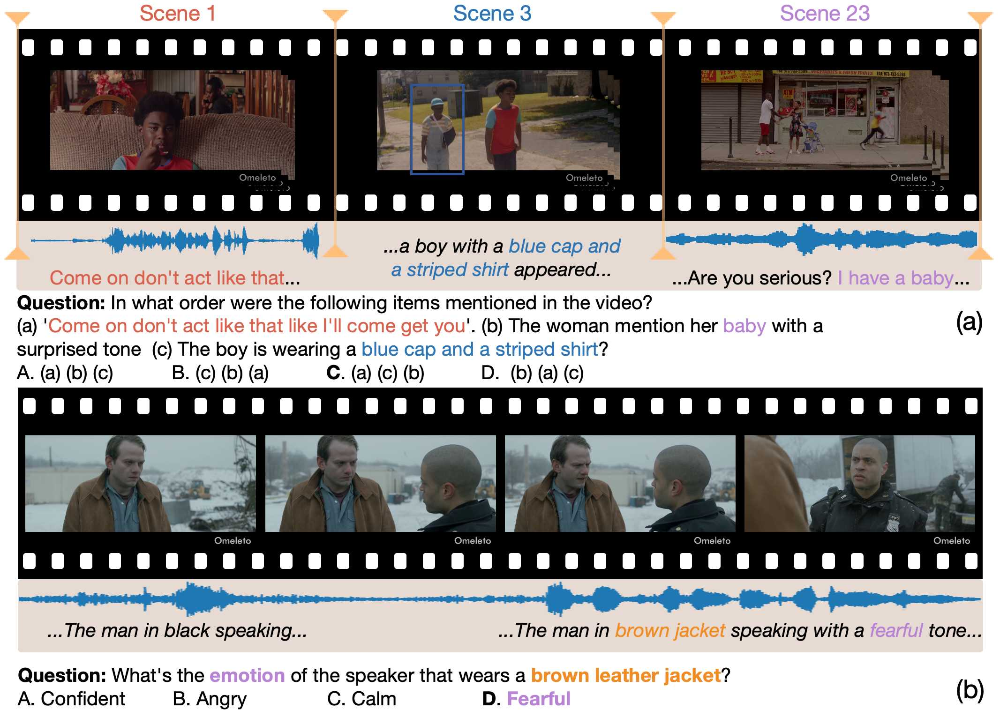
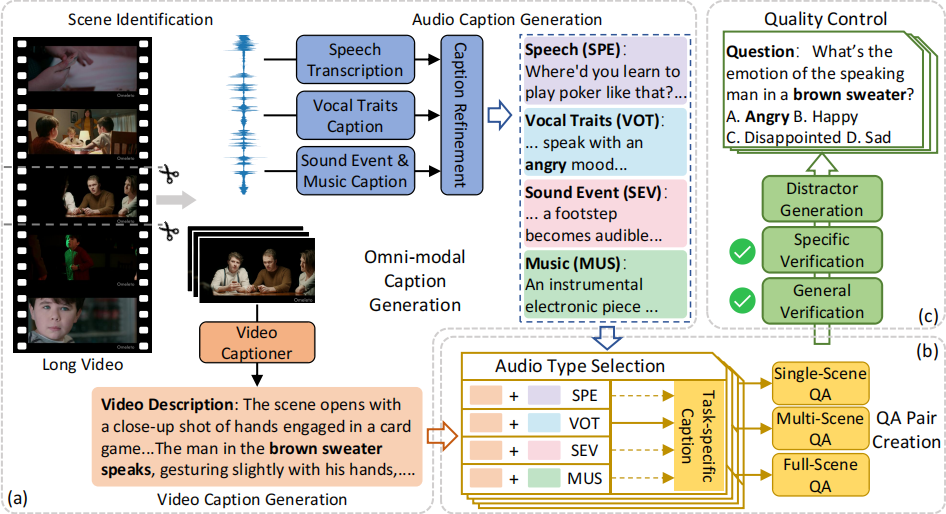
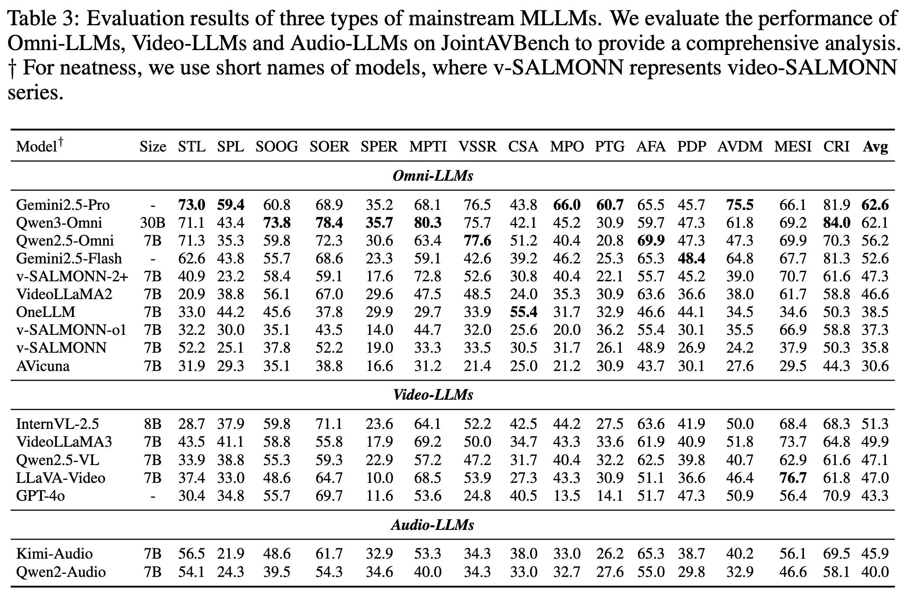

# JointAVBench: A Benchmark for Joint Audio-Visual Reasoning Evaluation

<div align="center">

[](https://arxiv.org/pdf/2512.12772)
[](https://jointavbench.github.io)
[](https://huggingface.co/datasets/JointAVBench/JointAVBench)
[](LICENSE)

</div>

---

## 📖 Overview

**JointAVBench** is a comprehensive benchmark for evaluating omni-modal large language models (LLMs) on joint audio-visual reasoning tasks. This repository showcases our benchmark generation pipeline and provides evaluation tools for assessing models on questions that require both visual and auditory information to answer correctly.

### ✨ Key Features

- **Large-scale Benchmark**: 2,853 questions across 15 diverse task types
- **Automated Generation Pipeline**: State-of-the-art vision-LLMs, audio-LLMs, and LLMs automatically synthesize questions requiring joint audio-visual reasoning
- **Multi-dimensional Coverage**:
  - **5 cognitive dimensions**: Temporal, Spatial, Long-form, Emotional, and Plot understanding
  - **4 audio information types**: Speech, Sound events, Music, and Speech emotion
  - **3 scene spans**: Single-scene, Multi-scene, and Full-scene reasoning
- **Comprehensive Evaluation**: Evaluation suite for majority mainstream omni-modal models
- **Challenging Tasks**: Multi-scene tasks requiring complex cross-modal reasoning

### 📄 Abstract

Compared to vision or audio large language models (LLMs), the key advantage of omni large language model lies in their joint audio-visual reasoning capability. To train such models, datasets with questions requiring both visual and auditory information to answer are needed. Moreover, videos contain complex audio signal types and scenes, interleaved with each other, demanding models with various cognitive capabilities. However, current datasets lack challenging multi-scene tasks, various types of audio information and cognition abilities.

This paper introduces **JointAVBench**, a dataset designed to answer questions that necessitate AV integration, spanning 5 cognitive dimensions, 4 audio information types, and 3 scene spans. Our benchmark reveals that the top omni-LLM achieves only 56.2% average accuracy, highlighting significant room for improvement, particularly in cross-scene reasoning.

## 📑 Table of Contents

- [Benchmark Overview](#-benchmark-overview)
- [Generation Pipeline](#-generation-pipeline)
- [Dataset](#-dataset)
- [Evaluation](#-evaluation)
- [Results](#-results)
- [Citation](#-citation)
- [License](#-license)

## 🎯 Benchmark Overview

### 📊 Task Categories

JointAVBench consists of **2,853 questions** across **15 distinct tasks** spanning multiple dimensions. Details about each task category can be found in the [paper](https://arxiv.org/pdf/2512.12772).

### 🎨 Example Questions

<div align="center">
  
  <p><em>Sample questions from different task categories showcasing the diversity of our benchmark</em></p>
</div>

### 🧠 Cognitive Dimensions

- **Temporal (tem)**: Understanding time-based relationships and ordering
- **Spatial (spa)**: Localizing sounds and understanding spatial relationships
- **Long-form (long)**: Processing and reasoning over extended content
- **Emotional (emo)**: Recognizing and understanding emotional content
- **Plot (plo)**: Comprehending narratives and storylines

## 🔄 Generation Pipeline

Our automated benchmark generation pipeline consists of several stages:

<div align="center">
  
  <p><em>Complete pipeline for automated benchmark generation from raw videos</em></p>
</div>


## 📦 Dataset

### ⬇️ Download the Benchmark

The JointAVBench dataset is available on Hugging Face:

```bash
# Download benchmark questions and videos
pip install huggingface_hub
huggingface-cli download JointAVBench/JointAVBench --local-dir ./data
```

The benchmark file `jointavbench.json` contains all 2,853 questions with metadata. Please note that due to content restrictions, we cannot share the raw videos. However, we provide a url to the original YouTube video for each question.

### 📂 Dataset Structure

```
JointAVBench/
├── annotations/                # Annotation data
├── jointavbench.json           # Evaluation code
├── README.md
```

### 📋 Data Format

Each question in the benchmark follows this format:

```json
{
  "qid": "-CEDoGn0w1s_task1_0",
  "video_name": "-CEDoGn0w1s",
  "task": "STL",
  "question": "Which objects are mentioned only in the dialogue but not clearly shown in the video, and when does the first object appear in the dialogue?",
  "correct_answer": "The broom, mentioned at around 6.34s",
  "explanation": "The object \"broom\" is mentioned in the dialogue but does not appear in the video description. It is the first object mentioned in the dialogue, appearing at around 6.34s.",
  "options": [
    "The shovel, mentioned at around 6.34s",
    "The keys, mentioned at around 3.36s",
    "The hat, mentioned at around 12.76s",
    "The broom, mentioned at around 6.34s"
  ],
  "video_url": "https://www.youtube.com/watch?v=-CEDoGn0w1s",
  "segment_timestamp": [653.444, 699.657]
}
```

## 🔬 Evaluation

### 🚀 Quick Start

For detailed evaluation instructions, see **[evaluation/README.md](evaluation/README.md)**.

```bash
# Navigate to evaluation folder
cd evaluation

# Set up environment (see evaluation/README.md)
cp .env.example .env
# Edit .env with your API keys and model paths

# Run evaluation
python evaluation.py --qa-path ../data/benchmark.json --model-name gemini --modality av
```

### 🤖 Supported Models

We provide evaluation scripts for 10+ models:

- **API-based**: Gemini, GPT-4o, Kimi-Audio
- **Open-source**: LLaVA-Video, InternVL, Qwen-VL/Audio/Omni, Video-LLaMA 2/3, AVicuna

See [evaluation/README.md](evaluation/README.md) for complete setup and usage instructions.

## 📊 Results

Our benchmark reveals significant challenges for current omni-modal models:

- **Top Performance**: 56.2% average accuracy
- **Cross-scene Reasoning**: Particularly challenging (42-50% accuracy)
- **Single-scene Tasks**: Relatively better (68% accuracy)
- **Performance Gaps**: Significant variations across cognitive dimensions and audio types

<div align="center">
  
  <p><em>Performance comparison of different models across task categories</em></p>
</div>

### 🔍 Key Findings

1. **Multi-modal Reasoning is Hard**: Even top models struggle to integrate audio-visual information effectively
2. **Scene Complexity Matters**: Performance degrades significantly for multi-scene and full-video tasks
3. **Audio Type Dependency**: Models perform differently on speech vs. music vs. sound events
4. **Cognitive Dimension Gaps**: Temporal and spatial reasoning show better results than plot understanding

For detailed results and analysis, please refer to our [paper](https://arxiv.org/pdf/2512.12772).

## 📁 Project Structure

```
jointavbench/
├── README.md                   # This file (project overview)
├── LICENSE                     # Apache 2.0 License
├── images/                    # Figures and visualizations
│   ├── framework.png         # Pipeline architecture diagram
│   └── examples.png          # Example questions showcase
├── evaluation/               # Evaluation code and documentation
│   ├── README.md            # Complete evaluation guide
│   ├── .env.example         # Environment configuration template
│   ├── evaluation.py        # Main evaluation script
│   └── eval_*.py            # Model-specific evaluation modules
├── gen_caption/             # Caption generation module
│   ├── README.md           # Caption generation documentation
│   ├── audio_caption.py    # Audio caption generation
│   ├── video_caption.py    # Video caption generation
│   └── utils.py            # Caption utilities
└── generation_pipeline/    # Benchmark generation pipeline
    ├── README.md          # Pipeline documentation
    ├── identify_intervals.py   # Interval identification
    ├── generate_qa.py          # QA generation
    ├── generate_distractor.py # Distractor generation
    ├── *_check.py             # Quality control scripts
    └── utils.py               # Pipeline utilities
```

## 📝 Citation

If you find JointAVBench useful for your research, please cite our paper:

```bibtex
@article{chao2025jointavbench,
  title={JointAVBench: A Benchmark for Joint Audio-Visual Reasoning Evaluation},
  author={Chao, Jianghan and Gao, Jianzhang and Tan, Wenhui and Sun, Yuchong and Song, Ruihua and Ru, Liyun},
  journal={arXiv preprint arXiv:2512.12772},
  year={2025}
}
```

## 📄 License

This project is licensed under the Apache License 2.0 - see the [LICENSE](LICENSE) file for details.

## 🙏 Acknowledgments

We thank the following projects and resources:

- [Qwen](https://github.com/QwenLM/Qwen) for audio and vision models
- The research community for open-source multimodal models

## 📮 Contact

For questions and feedback:

- **Evaluation Issues**: See [evaluation/README.md](evaluation/README.md)
- **Bug Reports**: Open an issue on GitHub
- **Project Page**: [https://jointavbench.github.io](https://jointavbench.github.io)
- **Email**: chaojh@ruc.edu.cn

---

<div align="center">

**For detailed evaluation instructions and environment setup, see [evaluation/README.md](evaluation/README.md)**

</div>
